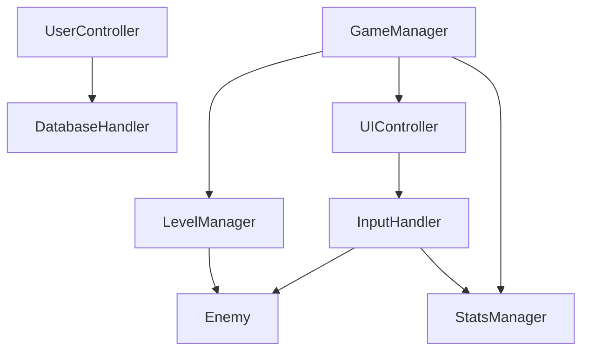
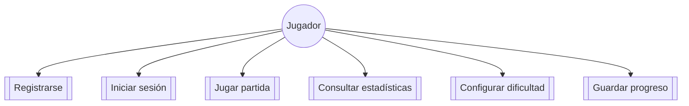
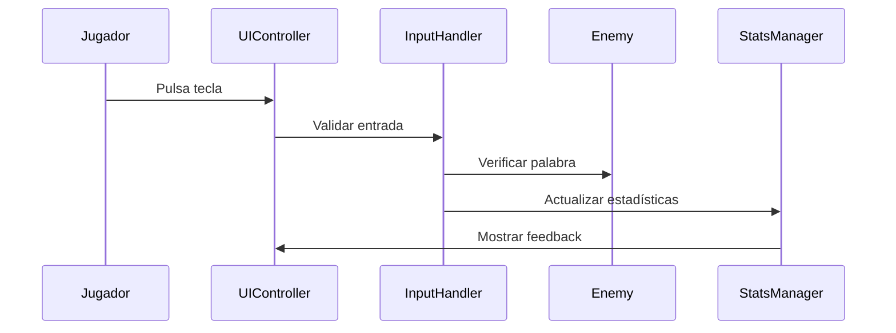
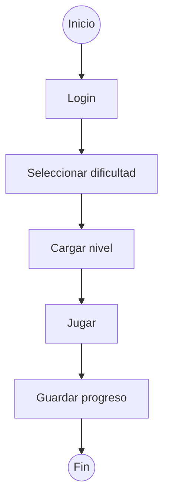
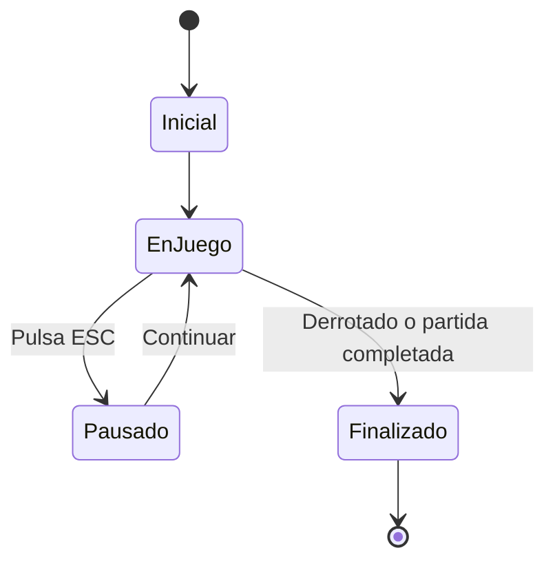

# CastilloQWERTY
## Diagrama modular

```mermaid
graph TD
    GameManager --> LevelManager
    GameManager --> UIController
    GameManager --> StatsManager
    UserController --> DatabaseHandler
    LevelManager --> Enemy
    InputHandler --> Enemy
    InputHandler --> StatsManager
    UIController --> InputHandler
```
## Diagrama casos de uso

```mermaid
graph TD
    Jugador((Jugador))
    Registrarse[[Registrarse]]
    IniciarSesion[[Iniciar sesión]]
    JugarPartida[[Jugar partida]]
    ConsultarEstadisticas[[Consultar estadísticas]]
    ConfigurarDificultad[[Configurar dificultad]]
    GuardarProgreso[[Guardar progreso]]

    Jugador --> Registrarse
    Jugador --> IniciarSesion
    Jugador --> JugarPartida
    Jugador --> ConsultarEstadisticas
    Jugador --> ConfigurarDificultad
    Jugador --> GuardarProgreso
```
## Diagrama de secuencia

```mermaid
sequenceDiagram
    participant Jugador
    participant UIController
    participant InputHandler
    participant Enemy
    participant StatsManager

    Jugador->>UIController: Pulsa tecla
    UIController->>InputHandler: Validar entrada
    InputHandler->>Enemy: Verificar palabra
    InputHandler->>StatsManager: Actualizar estadísticas
    StatsManager->>UIController: Mostrar feedback
```
## Diagrama de actividades

```mermaid
flowchart TD
    Inicio((Inicio)) --> Login[Login]
    Login --> SeleccionarDificultad[Seleccionar dificultad]
    SeleccionarDificultad --> CargarNivel[Cargar nivel]
    CargarNivel --> Jugar[Jugar]
    Jugar --> GuardarProgreso[Guardar progreso]
    GuardarProgreso --> Fin((Fin))
```
## Diagrama de estados

```mermaid
stateDiagram-v2
    [*] --> Inicial
    Inicial --> EnJuego
    EnJuego --> Pausado : Pulsa ESC
    Pausado --> EnJuego : Continuar
    EnJuego --> Finalizado : Derrotado o partida completada
    Finalizado --> [*]
```
